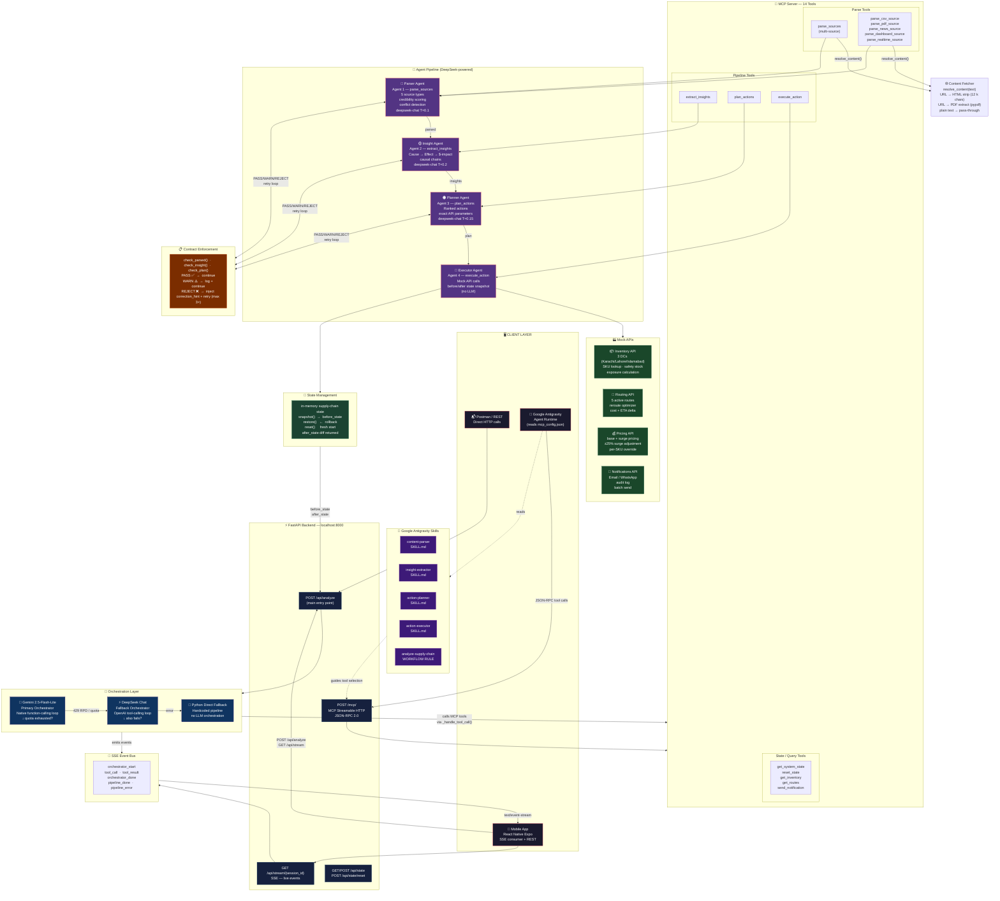

# ChainSight — Architecture Diagram



---

## Data Flow Summary

```
┌─────────────────────────────────────────────────────────────────────┐
│                     TWO ENTRY PATHS                                 │
│                                                                     │
│  PATH A — Direct API (Postman / Mobile App)                        │
│  POST /api/analyze  →  Orchestrator  →  MCP Tool calls  →  Agents  │
│                                                                     │
│  PATH B — Google Antigravity (MCP)                                 │
│  Antigravity reads Skills  →  POST /mcp/  →  Agents               │
└─────────────────────────────────────────────────────────────────────┘

ORCHESTRATION PRIORITY:
  1. Gemini 2.5-Flash-Lite  (native function calling)
     └─ quota exhausted (429 RPD) ──►
  2. DeepSeek Chat  (OpenAI-compat tool calling)
     └─ error ──►
  3. Python hardcoded fallback  (no LLM)

SERIAL EXECUTION CHAIN (enforced by orchestrator):
  parse_sources  ──►  extract_insights  ──►  plan_actions  ──►  execute_action

PARALLEL CONTENT TYPES (within parse_sources):
  csv_json  |  pdf_report  |  news_article  |  dashboard  |  realtime_feed

CONFLICT RESOLUTION (within Parser Agent):
  credibility: realtime(0.92) > dashboard(0.85) > news(0.80) > pdf(0.75) > csv(0.70)
  age penalty: −0.20 if source > 24h old
  resolution logged in parsed.contradictions[]

CONTRACT ENFORCEMENT per agent:
  PASS  → continue
  WARN  → log warning, continue
  REJECT → inject correction_hint, retry (max 3 iterations)

STATE MANAGEMENT:
  before_state snapshot taken before execute_action
  after_state diff returned in AnalyzeResponse.execution
  rollback available via POST /api/state/reset
```

---

## File Structure

```
Hackathon--AI-Seekho/
├── backend/
│   ├── main.py                  FastAPI app, endpoints
│   ├── orchestrator.py          Gemini → DeepSeek → Python fallback
│   ├── gemini_client.py         Gemini API wrapper, model fallback chain
│   ├── deepseek_client.py       DeepSeek API wrapper, agentic loop
│   ├── mcp_server.py            MCP Streamable HTTP, 14 tools
│   ├── content_fetcher.py       URL/PDF auto-fetch
│   ├── contract.py              PASS/WARN/REJECT enforcement
│   ├── state.py                 In-memory supply-chain state
│   ├── models.py                All Pydantic schemas
│   ├── agents/
│   │   ├── parser_agent.py      Agent 1 — multi-source parser (DeepSeek)
│   │   ├── insight_agent.py     Agent 2 — causal chains (DeepSeek)
│   │   ├── planner_agent.py     Agent 3 — action planner (DeepSeek)
│   │   └── executor_agent.py    Agent 4 — mock API executor
│   └── mock_apis/
│       ├── inventory.py         3 distribution centers, SKU lookup
│       ├── routing.py           5 routes, reroute optimizer
│       ├── pricing.py           Base + surge pricing
│       └── notifications.py     Email/WhatsApp + audit log
├── .agents/
│   ├── rules/
│   │   └── analyze-supply-chain.md   Antigravity workflow
│   └── skills/
│       ├── content-parser/SKILL.md
│       ├── insight-extractor/SKILL.md
│       ├── action-planner/SKILL.md
│       └── action-executor/SKILL.md
├── mcp_config.json              Points Antigravity → localhost:8000/mcp/
├── ChainSighst.postman_collection.json
└── ARCHITECTURE.md              ← this file
```
